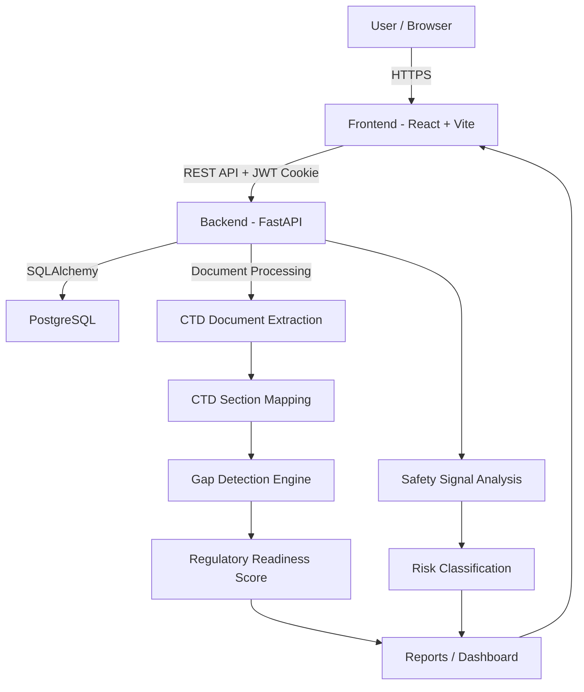

# Architecture

## System Architecture

PharmaGuard AI is a web-based AI-assisted pharmaceutical safety and regulatory submission-readiness platform. The frontend is a React/Vite application, the backend is a FastAPI service, and PostgreSQL stores authenticated users, uploaded document metadata, analyses, safety-signal results, and reports.



## Components

| Component | Technology | Responsibility |
|---|---|---|
| Frontend | React, TypeScript, Vite | Dashboard UI, authentication screens, document upload, gap detection, safety analysis, reports |
| Backend API | FastAPI, Python | Authentication, business logic, document processing orchestration, gap analysis, safety analysis, reporting APIs |
| CTD Analysis | Python document-processing logic | Extracts document text, identifies CTD sections, evaluates completeness, records evidence, and generates gap results |
| Safety Analysis | Python analysis services | Processes adverse-event data, analyzes safety patterns, calculates signal metrics where applicable, and classifies risk |
| Database | PostgreSQL | Stores users, document metadata, analysis results, signals, gaps, reviews, and reports |
| Authentication | JWT, bcrypt | Secure user authentication and protected API access |
| Web Server | Nginx | Serves the production React application and provides SPA routing/security headers |
| Deployment | Docker, Render | Runs the frontend and backend as separately deployable services with managed PostgreSQL |

## Data Flow

### CTD Gap Detection

1. The authenticated user uploads CTD documents through the React frontend.
2. The frontend sends the document request to the FastAPI backend.
3. The backend validates the authenticated user and stores document metadata.
4. Supported PDF, DOCX, and TXT content is extracted and normalized.
5. The system detects CTD section codes and headings from document content rather than relying only on filenames.
6. Detected sections are mapped to the CTD requirement structure.
7. Each section is classified as `PRESENT`, `PARTIAL`, `MISSING`, `NOT_APPLICABLE`, or `REVIEW_REQUIRED`.
8. Supporting evidence such as document name, page, and text snippet is retained when available.
9. Applicable gaps are classified by priority/severity and actionable recommendations are generated.
10. Regulatory readiness is calculated from the actual section results.
11. The results are stored and returned through the API.
12. The React Gap Detection page displays the results, evidence, filters, module progress, and readiness score.

### Safety Signal Analysis

1. The authenticated user provides adverse-event data.
2. The backend validates and normalizes the submitted records.
3. The analysis service groups relevant events and evaluates available safety-signal evidence.
4. Statistical signal metrics are calculated when the available dataset supports them.
5. Results are classified into an appropriate risk/evidence category.
6. The dashboard presents the findings and supporting information.
7. Results can be used in reports and further human review.

## Security Considerations

- Passwords are never stored in plaintext; passwords are hashed using bcrypt.
- JWT authentication protects application APIs.
- JWT payloads contain only minimal identity/authorization information such as user ID, email, role, issue time, and expiry.
- Production secrets such as `JWT_SECRET` and `DATABASE_URL` are stored as environment variables and are not committed to Git.
- The frontend uses the configured backend API URL in production.
- Backend authorization should derive the user identity from the authenticated token rather than trusting a frontend-supplied user ID.
- User-owned documents, analyses, signals, and reports are isolated by authenticated user.
- CORS should allow only the configured frontend origin in production.
- Database access uses SQLAlchemy/parameterized database operations rather than constructing SQL from untrusted input.
- API errors should avoid exposing passwords, secrets, database credentials, or other sensitive information.
- Demo data is separated from real user data and is clearly labeled as fictional demonstration data.

## Scalability Notes

The FastAPI service is designed to remain stateless at the application layer, while persistent state is stored in PostgreSQL. The architecture can be extended by horizontally scaling the backend behind a load balancer and moving expensive document extraction/AI analysis into background workers. Large document processing can also be queued, cached, and processed asynchronously. PostgreSQL indexes and pagination should be used as document, event, gap, and report volumes grow.

## Deployment

The production deployment uses separate services:

- React/Vite frontend served by Nginx.
- FastAPI backend served by Uvicorn.
- Managed PostgreSQL database.
- Environment variables connect the services securely.

The frontend should use:

```env
VITE_API_URL=https://bob-ai-hackathon-pharmanex-1.onrender.com
```

The production frontend is deployed separately from the backend, so the frontend Nginx configuration does not proxy `/api` to a Docker hostname such as `backend`.
